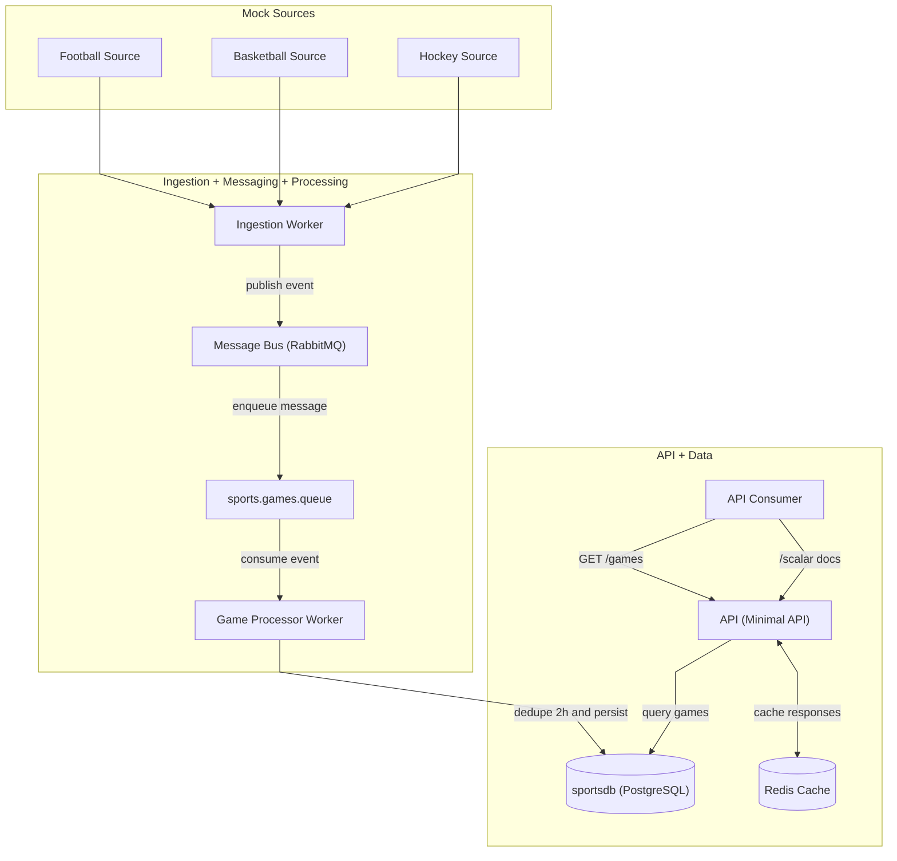

# Sports Aggregator

A distributed sports games aggregation system built with .NET 10 and .NET Aspire.

It ingests mock game events, deduplicates near-duplicate matches, stores data in PostgreSQL, and serves filtered results through a minimal API.

## What This Does

This project runs a small event-driven pipeline:

1. `SportsAggregator.Ingestion` generates mock games for football, basketball, and ice hockey.
2. Events are published to RabbitMQ via MassTransit.
3. `SportsAggregator.GameProcessor` consumes events, computes a deterministic `match_key`, and skips duplicates within a +/-2 hour window.
4. Unique games are persisted to PostgreSQL.
5. `SportsAggregator.Api` exposes `GET /games` with filters and caching.

## Architecture Diagram

### High-Level System Architecture



## Tech Stack

- .NET 10 (C#)
- .NET Aspire (AppHost orchestration + ServiceDefaults)
- ASP.NET Core Minimal API
- PostgreSQL + EF Core
- RabbitMQ + MassTransit
- Redis + FusionCache
- xUnit + AwesomeAssertions + NSubstitute + Aspire.Hosting.Testing

## Quick Start

### Prerequisites

- .NET SDK 10.0+
- Aspire CLI 13.x
- Docker Desktop running

### Run the app

```bash
aspire run
```

Wait for all resources to become healthy in the Aspire Dashboard (`api`, `ingestion`, `game-processor`, `db-migration`, `postgres`, `redis`, `rabbitmq`).

### Try the API

Use the `api` HTTP endpoint URL shown in the dashboard, then call:

```bash
curl "<api-url>/games"
```

Open API docs in development:

```text
<api-url>/scalar
```

## API Usage

Endpoint:

- `GET /games`

Query params:

- `sport` (optional): `football`, `basketball`, `ice_hockey`
- `competition` (optional): case-insensitive partial match
- `from` (optional): ISO-8601 date-time
- `to` (optional): ISO-8601 date-time

Validation:

- `from` must be less than or equal to `to`
- invalid `sport` returns `400 Bad Request`

Examples:

```bash
curl "<api-url>/games?sport=football"
curl "<api-url>/games?competition=league"
curl "<api-url>/games?from=2026-02-17T00:00:00Z&to=2026-02-18T00:00:00Z"
```

## Project Structure

```text
src/
  SportsAggregator.AppHost/            Aspire orchestration
  SportsAggregator.ServiceDefaults/    Shared telemetry, health checks, resilience
  SportsAggregator.Domain/             Entities, contracts, domain services
  SportsAggregator.Infrastructure/     EF Core DbContext, migrations, messaging helpers
  SportsAggregator.Api/                Minimal API (`GET /games`)
  SportsAggregator.Ingestion/          Mock source workers and publisher
  SportsAggregator.GameProcessor/      Message consumer, dedup, persistence
  SportsAggregator.DbMigrationService/ Startup migration runner

tests/
  SportsAggregator.Domain.Tests/
  SportsAggregator.Infrastructure.Tests/
  SportsAggregator.GameProcessor.Tests/
  SportsAggregator.Api.Tests/
  SportsAggregator.AppHost.Tests/
```

## Testing

```bash
dotnet build SportsApp.sln
dotnet test SportsApp.sln
```

Note: integration tests use Aspire distributed app testing and require Docker.

## Notes

- Deduplication is based on normalized sport/competition/team names and a fixed 2-hour absolute window.
- Team order is normalized, so home/away swaps for the same matchup map to the same `match_key`.
- API responses are cached (FusionCache + Redis integration) to improve repeated query performance.
